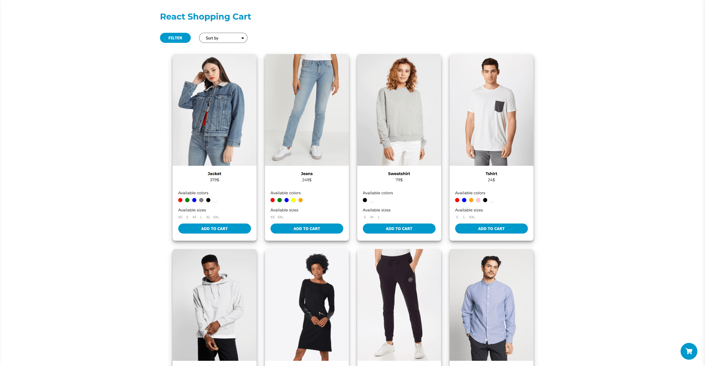

# React - shopping-cart

https://rawfour.github.io/shopping-cart-react/



## Table of contents

- [Instructions](#Instructions)
- [Description](#Description)
- [Technologies](#Technologies)

## Instructions

First clone this repository.

```bash
$ git clone https://github.com/rawfour/shopping-cart-react.git
```

Install dependencies. Make sure you already have [`nodejs`](https://nodejs.org/en/) & [`npm`](https://www.npmjs.com/) installed in your system.

```bash
$ npm install # or yarn
```

Run it

```bash
$ npm start # or yarn start
```

## Description

This is a simple shopping cart with product sort option on the product list.

## Technologies

Project uses:

- React
- Redux
- Styled Component
- Tools: Eslint, Prettier, Storybook,

* React + React Hooks
* Redux
* Styled Component
* Tools: ESlint, Husky + lint-staged, Storybook
